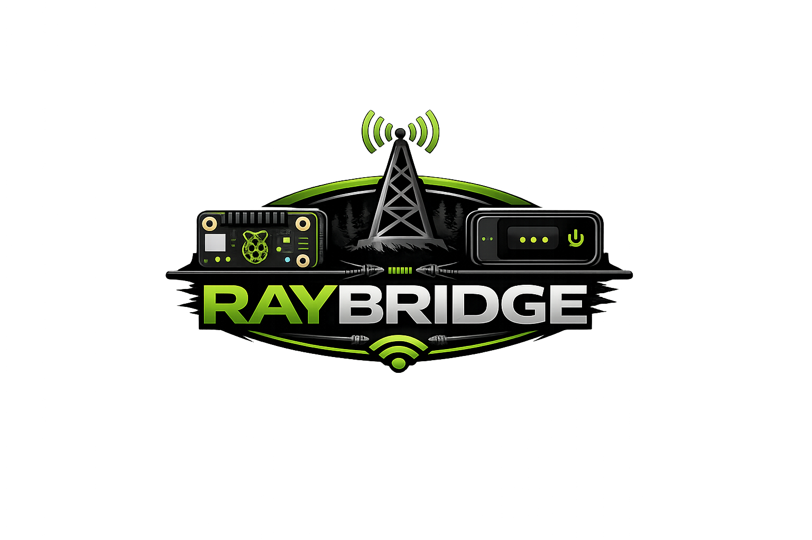

# RayBridge • Stingray Sentinel



## 🛰️ Overview

**RayBridge** is an off-grid monitoring and visualization system designed to pair a
**Raspberry Pi** with an **Orbic device running Rayhunter**.

It provides a clear, always-on operational view via:
- A web dashboard
- A dedicated LCD dashboard for field deployment
- Continuous system health and connectivity awareness

RayBridge is built for **portable, low-connectivity, and security-focused environments**.

---

## ✨ Features

- System health state (OK / CHECK / ALERT)
- Orbic connectivity monitoring
- Packet capture counting
- Event timestamp tracking
- Web-based dashboard
- Dedicated LCD UI (SPI display)
- USB + Wi-Fi routing awareness
- Daily heartbeat email
- Visual alert overlay mode

---

## 🖥️ Interfaces

### Web Dashboard
Accessible from any browser on the local network:

```
http://<pi-ip>/rayhunter/
```

---

### LCD Dashboard (Optional)
Optimized for **480×300 SPI displays**.

Features:
- Enlarged RayBridge logo
- **STINGRAY SENTINEL** header
- Radar-style system status
- Orbic connection indicator
- Three live metric cards
- Touch-based **REFRESH // ACK**
- Alert overlay with visual emphasis

---

## 🔐 Security Model

- No credentials are committed to GitHub
- Installer secrets remain **local only**
- GitHub access uses **Personal Access Tokens**
- `.gitignore` prevents accidental secret commits

---

## 🧪 Future Development

### 📡 Meshtastic
Mesh networking between RayBridge nodes.

### 🧠 Simulation Mode
Run RayBridge without an Orbic device for demos or testing.

### 🔔 Beep / Alarm
Optional GPIO-based audible alerts.

---

## 📄 License

MIT License — see `LICENSE` for details.
